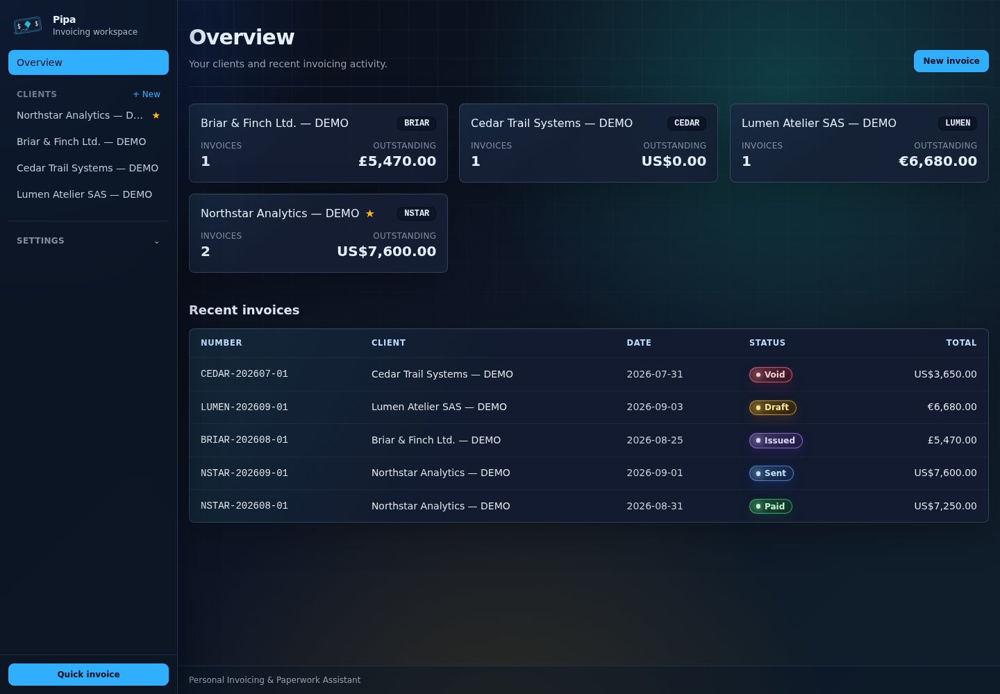
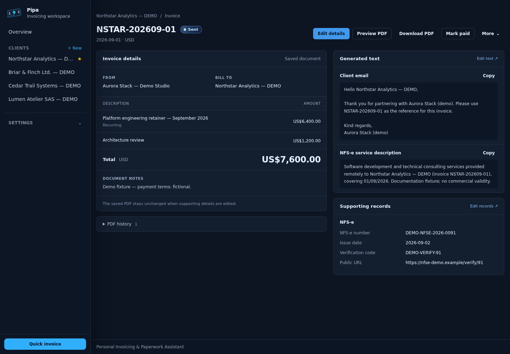
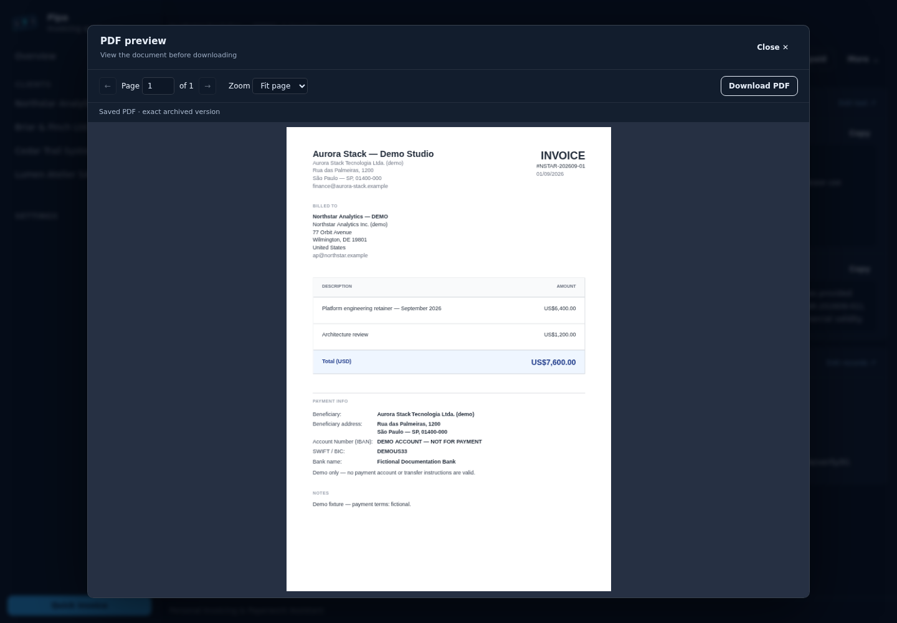
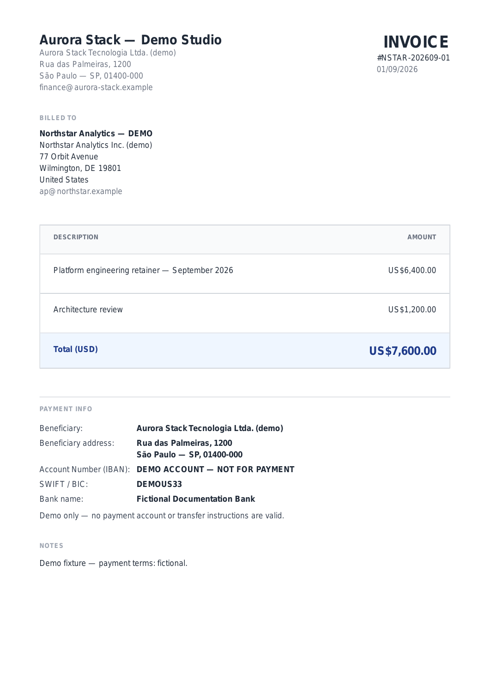

# Pipa


Pipa (Personal Invoicing & Paperwork Assistant) is a lightweight invoicing workspace for freelancers, independent developers, and small service businesses. Create professional invoice PDFs and keep client details, correspondence, and supporting documents together.

Built for a small number of recurring or occasional invoices, it helps you reuse the details and text you need each month—whether your clients are local or overseas.



Pipa is a web app designed for self-hosting, but it is also practical to use on your own computer: SQLite keeps your data local, and the app can run as a compiled Bun executable. Start it locally and open it in your browser—no separate database server needed. This is browser-based desktop use, not a native desktop app. Windows, Linux, and macOS downloads are available from [releases](https://github.com/arieltl/pipa/releases); see the [desktop-use guide](docs/desktop.md) for architectures and setup.

## Features

- Create, preview, and download invoice PDFs with customizable templates.
- Reuse client details, currencies, numbering rules, and recurring line items.
- Generate editable emails, messages, and bookkeeping notes from invoice information.
- Keep supporting records, references, and attachments beside each invoice.
- Track invoices from draft through issued, sent, and paid, with a void option.
- Preserve issued PDFs and historical invoice details when client defaults change.

## Planned features

- Built-in authentication.
- An improved template text editor.
- Better invoice and template previews.
- Simpler configuration and onboarding.
- Easier setup for the optional HTML-to-PDF renderer (Gotenberg).
- Backup and restore assistance.
- Data export.

See the [roadmap](docs/roadmap.md) for direction; no release dates are promised.

## Why I built it

I built this for my own workflow as a developer running a small business in Brazil and invoicing overseas clients. The tools I tried were either more complex than my monthly routine needed or did not help enough with organizing the text and documentation around each invoice.

*Pipa* means “kite” in Brazilian Portuguese—and doubles as Personal Invoicing & Paperwork Assistant.

That need is not specific to Brazil. A consultant can reuse an invoice email, a freelancer can keep delivery notes and receipts alongside a project invoice, and a small studio can use consistent client details and numbering each month. The aim is a focused invoicing workspace, not another system to administer.

Some screens include **NFS-e**, Brazil's electronic service tax invoice, because it is part of the original workflow. Those fields help keep information about separately issued tax documents; the app does not issue them. You do not need to use that workflow: configurable text generators and supporting records can hold the correspondence, references, and attachments relevant to your business.

## A look inside

Client workspaces and recent invoicing activity. All pictured data is fictional.


A compact invoice overview with generated text, supporting field values, and document actions:



Preview the saved PDF in the app, with selectable text, zoom, page controls, and a separate download action:



An actual generated invoice PDF, shown here as an image:



See the [screenshot gallery and demo setup](docs/demo.md) for the continuous invoice editor, client configuration, and images rendered from actual generated invoice PDFs.

## Install with Docker Compose (GHCR)

This beta has no built-in authentication. Use localhost, a trusted private network, or an authenticating reverse proxy—never expose it directly to the public internet. Read the [deployment security guidance](docs/self-hosting.md#security-boundary) before enabling remote access.

Use the prebuilt image from GHCR; no Bun installation or local image build is required. Download or clone this repository to obtain `compose.yml` (and `compose.gotenberg.yml` if wanted), then run from that directory:

```sh
mkdir -p data
chown -R 1000:1000 data
docker compose -f compose.yml pull
docker compose -f compose.yml up -d
```

Open <http://localhost:3000>. On first use, configure the issuer, create a client, then create an invoice. See [the user guide](docs/user-guide.md).

`compose.yml` pins `ghcr.io/arieltl/invoice:0.3.0` by default. Set `INVOICE_IMAGE_TAG` to the desired published version when upgrading, and back up your data first. While the repository/image is private, pulling may require GHCR access.

The repository is now [arieltl/pipa](https://github.com/arieltl/pipa). The GHCR image name, Compose service `invoice`, and executable `dist/invoice` retain their existing names for deployment compatibility.

Both Compose files bind to `127.0.0.1` by default. Set `INVOICE_BIND_ADDRESS` to a trusted LAN interface only when you intend to allow network access. Remote access needs an authenticating proxy or private-network gateway.

For the optional HTML/Liquid renderer, start the private Gotenberg service:

```sh
docker compose -f compose.yml -f compose.gotenberg.yml pull
docker compose -f compose.yml -f compose.gotenberg.yml up -d
```

Gotenberg uses Chromium and needs substantially more memory and CPU than React PDF. It is not a fallback: an unavailable Gotenberg render fails clearly and does not alter the invoice or its archived PDF. See [self-hosting operations](docs/self-hosting.md) for configuration, backups, upgrades, and proxy guidance.

## Development or unreleased code

To work on the source, install [Bun](https://bun.sh/) and run:

```sh
bun install --frozen-lockfile
bun run db:migrate
bun run dev
```

Alternatively, build an image locally with `docker compose -f docker-compose.yml up --build -d`. This is optional, not the normal self-hosting installation path. Do not run source-build and prebuilt stacks against the same data directory at the same time.

## Documentation

- [User guide](docs/user-guide.md)
- [Self-hosting and operations](docs/self-hosting.md)
- [Use on your own computer](docs/desktop.md)
- [PDF and text template reference](pdf_template_author_reference.md)
- [Contributing](CONTRIBUTING.md)
- [Roadmap](docs/roadmap.md)
- [Design guide](docs/design.md)
- [AI contribution policy](AI_POLICY.md)
- [Security and reporting](SECURITY.md)

The design guide describes the current implementation; the roadmap lists approved future improvements.

## License

[MIT](LICENSE) — Copyright (c) 2026 Ariel Tamezgui Leventhal.

## AI use notice

This project was developed with extensive use of AI-assisted development workflows. It started as a way to solve a very specific personal workflow, and without AI assistance, I could not have justified the time needed to build it. As described in [CONTRIBUTING.md](CONTRIBUTING.md) and the [AI contribution policy](AI_POLICY.md), AI assistance is encouraged—but human contributors remain the quality gate. Understanding, reviewing, and testing the work is our responsibility, regardless of who—or what—typed it.

This software is in very early beta. Expect bugs, rough edges, and unfinished features, as with any prerelease software. Whether a bug was handwritten or generated with remarkable confidence, it still needs fixing. AI is neither an excuse nor a warranty: there is work left to do, and we are accountable for what we ship.

Coauthored by GPT 😆
