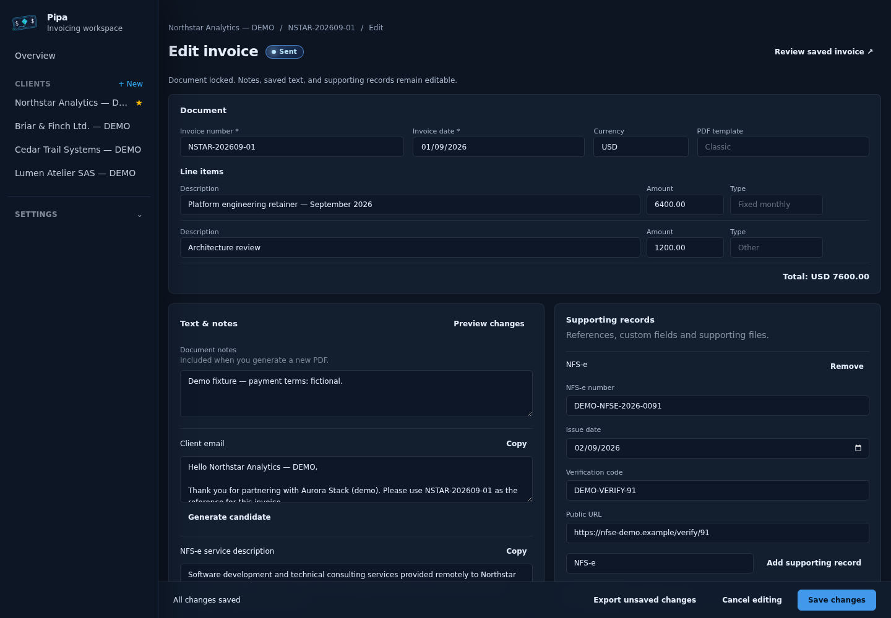
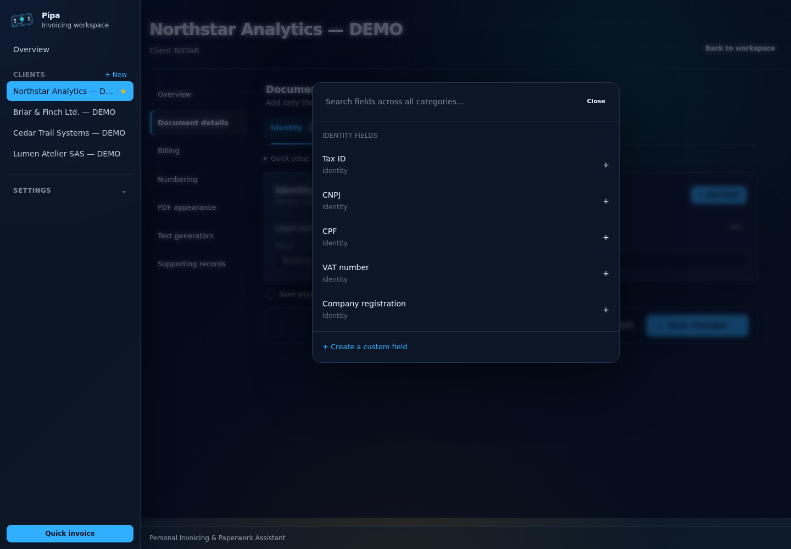
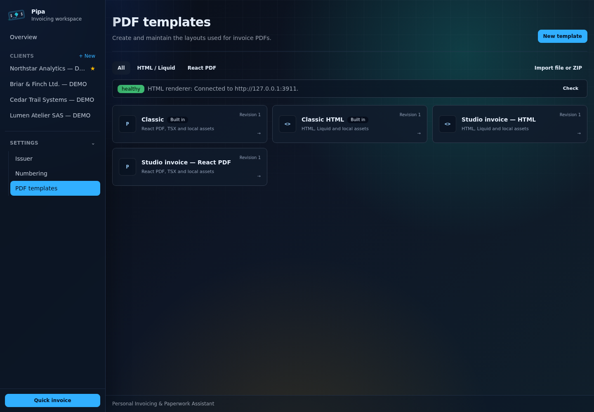
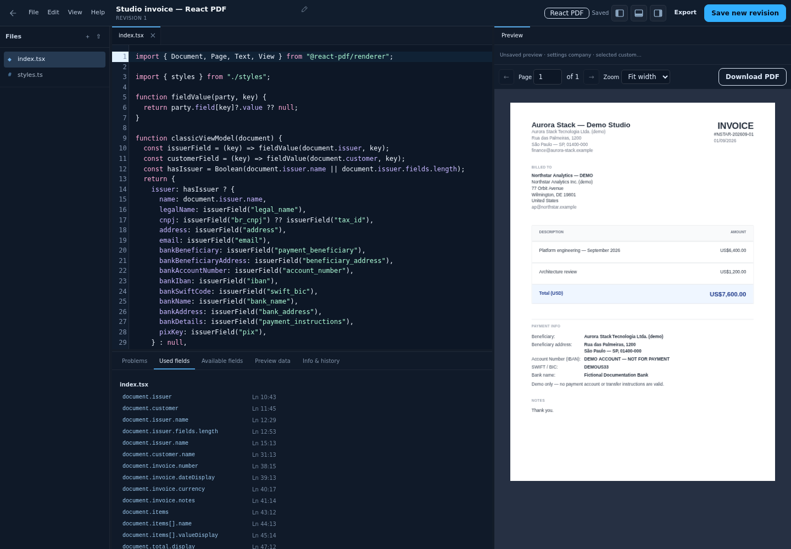
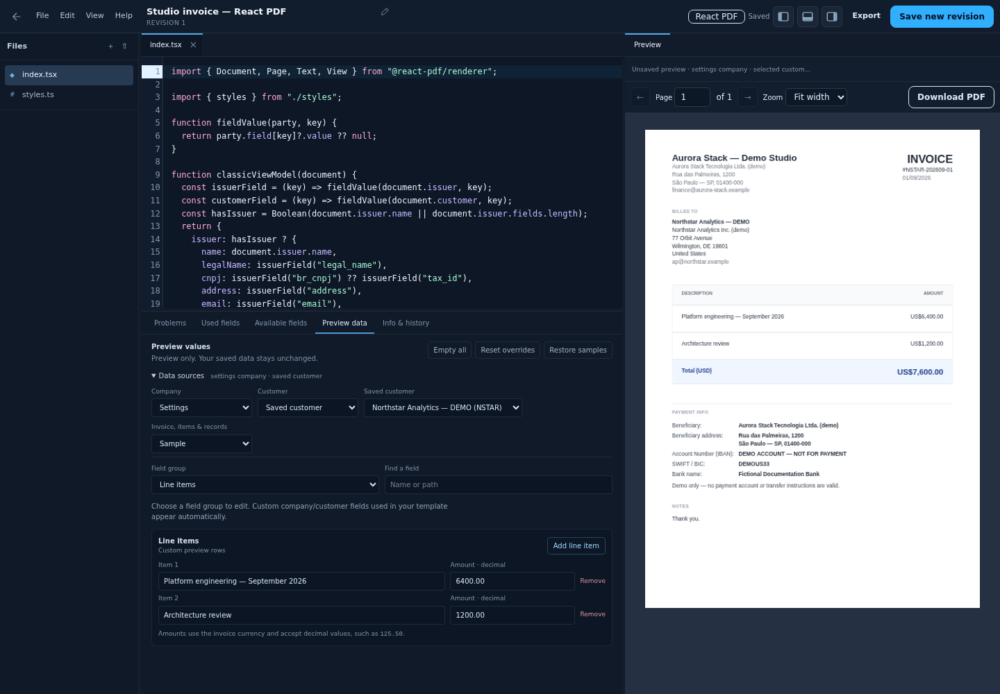
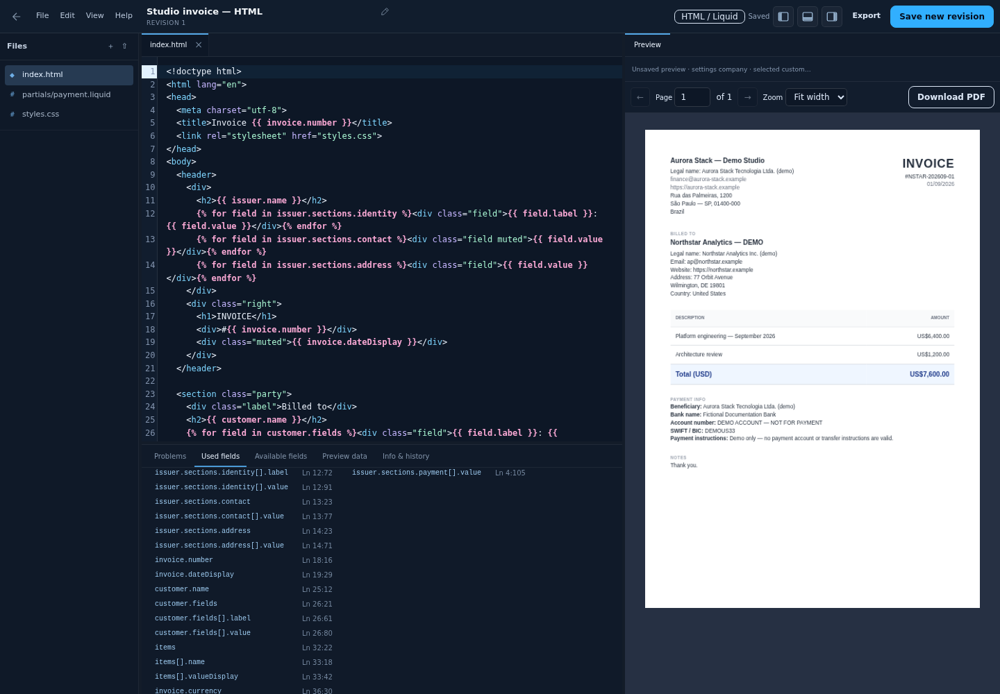
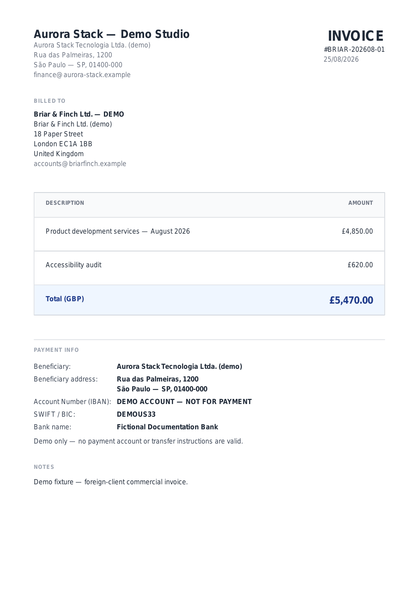

# Screenshots and fictional demo data

These are captures of the running application, not mockups. All company names,
addresses, invoice details, and payment information are fictional demonstration
data. Email and website addresses use reserved `.example` domains. None of the
payment details should be used for a transfer.

## Overview

Client workspaces and recent invoices across several currencies and statuses.
Outstanding includes draft, issued, and sent invoice item totals; paid and void
invoices are excluded.


## Invoice workspace

A sent invoice with compact line items, copyable generated text, and supporting
record values visible alongside the saved document.


## Invoice editor

Document fields, text, notes, and supporting records share one continuous page
and one **Save changes** action. This sent invoice has a locked document; its
notes, generated text, and supporting records remain editable.



## In-page PDF preview

The PDF.js viewer displays the exact saved PDF without leaving the invoice or
starting a download. It includes selectable text, page navigation, zoom, and a
separate download action. The editor can also preview unsaved changes.


## Client document fields

The client settings workspace and searchable field picker. Fields can be added
from the catalog or defined with a custom name.



## Template library

The library lists built-in layouts alongside editable copies, with their engine
and current revision. Create a template or import a single source file or ZIP.
The connection strip reports the optional Gotenberg renderer's status.



## React PDF template editor

An editable Classic-based layout with `index.tsx` and a separate `styles.ts`.
The left panel lists package files, the bottom panel navigates field references,
and the right panel renders the complete package. The layout icons toggle each
panel; the source remains editable while the preview updates.



## Preview data

Choose company settings, a saved client, samples, or empty values, then override
individual fields. Add or remove line items to test totals and longer invoices.
These values affect only the preview and reset when the editor is reloaded.
This capture uses the fictional Northstar customer and two manually entered rows.



## HTML and Liquid template editor

This package keeps CSS in `styles.css` and payment details in a local Liquid
partial. Gotenberg renders the HTML; PDF.js displays the result in the editor.
Both engines use the same preview-data controls and revision workflow.



## Generated PDFs

These images were rasterized from actual PDFs archived by the application's
built-in React PDF renderer. They are not browser prints or AI-generated images.
The fixtures demonstrate USD and GBP invoices.

### USD invoice


### GBP invoice



## Run the demo locally

This optional source-development fixture is separate from the normal
[GHCR installation](self-hosting.md). It needs Bun and the repository checkout.

```sh
bun install --frozen-lockfile
bun run build
bun run scripts/seed-demo.ts
DATA_DIR=./data/docs-demo DB_PATH=./data/docs-demo/app.db FILES_DIR=./data/docs-demo/files TMP_DIR=./data/docs-demo/tmp PORT=3002 bun run start
```

Open <http://localhost:3002>. The fixture contains four clients, USD/GBP/EUR
invoices, draft/issued/sent/paid/void examples, text generators, and supporting
records, and two editable template packages (React PDF and HTML/Liquid). Invoice dates are fixed in July–September 2026 for reproducibility;
creation timestamps reflect when the script ran.

The seed script deliberately overrides inherited storage variables and uses
`data/docs-demo/`. It refuses existing unmarked databases and symlinked storage
paths; a completed demo seed is a no-op on subsequent runs. It never clears or
resets an existing database. To create another fixture, use an unused directory
such as `DEMO_DATA_DIR=./data/docs-demo-next`, then adjust all four storage paths
in the server command to match. Stop that demo server before manipulating its
data. Demo databases and archived files stay gitignored under `data/`.

## Refresh the images

Capture the demo at a desktop viewport (these UI captures used 1440 × 1000 CSS
pixels). Wait for fonts, styles, and transitions to settle. Capture these views:

| Image | Route and state |
| --- | --- |
| `overview.png` | `/`, showing client totals and recent invoices |
| `invoice-workspace.png` | `/invoices/2`, the saved sent invoice |
| `invoice-editor.png` | `/invoices/2/edit`, after the editing session is ready |
| `invoice-preview.png` | `/invoices/2`, click **Preview PDF** and wait for the page to finish rendering at **Fit page** zoom |
| `template-library.png` | `/settings/pdf-templates`, with both editable demo packages |
| `template-react-editor.png` | React demo package, **Used fields** tab, preview rendered |
| `template-preview-data.png` | React demo package, **Preview data**, data sources expanded and **Line items** group selected |
| `template-html-editor.png` | HTML demo package, **Used fields** tab, Gotenberg preview rendered |
| `client-field-picker.png` | `/clients/1/edit?section=details`, open the field picker |

Capture the actual viewport with Playwright or a browser preview tool. Keep the
Save bar visible in the editor capture. Review every image for private data
before committing; do not use a populated personal installation.

### Capture the UI gallery

Use a freshly seeded demo directory for the new template fixtures. A previously
completed seed remains a no-op and will not add templates to an older fixture.
The seed prints the editable template IDs; a fresh database uses IDs 3 and 4.
Start the demo server with all four isolated storage paths and
`GOTENBERG_URL` pointing to a private, reachable Gotenberg instance. React PDF
works without it, but the HTML screenshot requires a successful render.

The capture script uses Playwright installed outside the application's dependency
set. For example, after starting the isolated demo at port 3913:

```sh
mkdir -p /tmp/pipa-docs-browser
npm install --prefix /tmp/pipa-docs-browser playwright
PLAYWRIGHT_MODULE=/tmp/pipa-docs-browser/node_modules/playwright/index.mjs \
  CHROME_PATH=/usr/bin/google-chrome DEMO_URL=http://127.0.0.1:3913 \
  node scripts/capture-docs.mjs
```

Set `CHROME_PATH` to your installed Chromium/Chrome, or install Playwright's
Chromium and omit it. The script captures the five general UI views and four template views at 1440 × 1000,
waits for PDF rendering, and selects only fictional preview data. It does not
save template revisions. `SCREENSHOT_DIR` overrides the output directory.
Inspect all nine images before committing them.

PDFs are generated through the ordinary invoice issue/archive workflow. The
seed prints their local paths. With Poppler's `pdftoppm` installed, convert the
first page of the sample PDF to a PNG:

```sh
pdftoppm -f 1 -singlefile -scale-to 1500 -png \
  data/docs-demo/files/archived/invoices/2026/NSTAR-202609-01-northstar-demo.pdf \
  docs/images/invoice-pdf
```

Do not seed a real installation or use real client screenshots for the public
documentation. Only the reviewed images and seed source belong in Git.
